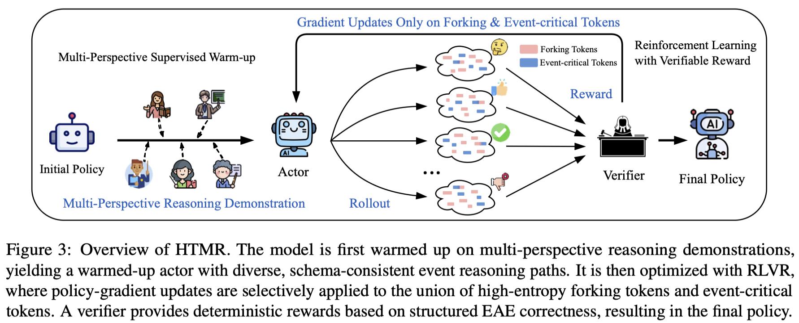

#  HTMR: Hybrid Token Masking Reinforcement Learning with Verifiable Rewards for Event Argument Extraction with Multi-Perspective Reasoning



## 🧹 Data Preprocessing

We evaluate our approach on two widely used benchmarks: **ACE 2005** ([LDC2006T06](https://catalog.ldc.upenn.edu/LDC2006T06)) and **ERE** ([LDC2023T04](https://catalog.ldc.upenn.edu/LDC2023T04)). Please note that these datasets are distributed by the Linguistic Data Consortium (LDC) and require a valid license for access.

Following previous work, we partition the ACE 2005 dataset into two distinct versions: **ACE05-E** and **ACE05-E+**. 

Our data preprocessing pipeline follows the methodology established by [Scented-EAE](https://github.com/yy-degit/Scented-EAE), which provides a strong reference implementation for EAE research.

### 1. Dataset Directory Structure

We provide the necessary entity mapping and template files for each dataset in the `datasets/` directory to ensure reproducibility. After preprocessing, the directory should be organized as follows:

```text
datasets/
├── ACE-E/
│   ├── ace_entity_map.json
│   ├── ace_template.json
│   ├── dev.oneie.jsonl
│   ├── test.oneie.jsonl
│   └── train.oneie.jsonl
├── ACE-E-Plus/
│   ├── ace_entity_map.json
│   ├── ace_template.json
│   ├── dev.oneie.jsonl
│   ├── test.oneie.jsonl
│   └── train.oneie.jsonl
└── ERE/
    ├── ere_entity_map.json
    ├── ere_template.json
    ├── test.json
    ├── train.json
    └── valid.json
```

### 2. Preprocessing Steps

To convert the raw LDC data into the format used in this repository, please follow these steps (based on the [Scented-EAE](https://github.com/yy-degit/Scented-EAE) pipeline):

1.  **Prepare the Directory Structure**: Create the following directory structure for the preprocessing workspace:
    ```text
    data/
    ├── dataset/
    │   ├── ace/
    │   │   ├── event-split/
    │   │   └── event-plus-split/
    │   └── ere/
    │       └── split/
    ├── new_data/
    ├── prompt/
    │   └── [templates and mapping files]
    └── raw_data/
    ```

2.  **Download Raw Datasets**: Obtain the **ACE 2005** ([LDC2006T06](https://catalog.ldc.upenn.edu/LDC2006T06)) and **ERE** ([LDC2023T04](https://catalog.ldc.upenn.edu/LDC2023T04)) archives from LDC.

3.  **Extract and Organize**: Extract the LDC archives and place the relevant subdirectories into `data/dataset/ace` and `data/dataset/ere` respectively.

4.  **Run Preprocessing**: Execute the preprocessing scripts to generate the final ACE05, ACE05+, and ERE datasets for training and evaluation.

For more detailed instructions, please refer to the [Scented-EAE](https://github.com/yy-degit/Scented-EAE/blob/main/README.md).

## ⚙️ Environment Configuration

This project is built upon the [Verl](https://github.com/volcengine/verl) framework. We recommend using the following key dependency versions for optimal compatibility:

*   **python**: `3.10`
*   **verl**: `0.5.0.dev0`
*   **torch**: `2.6.0`
*   **xformers**: `0.0.29.post2`
*   **vllm**: `0.8.5.post1`
*   **flash-attn**: `2.7.4.post1`
*   **flashinfer**: `0.2.2.post1`

For installation, we follow the simplified process for running with **FSDP**.

```bash
conda create -n verl_env python==3.10
conda activate verl_env

# if you simply need to run with FSDP
cd HTMR
USE_MEGATRON=0 bash scripts/install_vllm_sglang_mcore.sh

# Install verl
pip install --no-deps -e .
```

For more details, please refer to the [Verl Installation Guide](https://verl.readthedocs.io/en/latest/start/install.html).

> We use **[SwanLab](https://github.com/SwanHubX/SwanLab)** for experiment tracking and visualization.
> If you wish to use it, please ensure you have installed it via `pip install swanlab` and set your API key in the environment:
> ```bash
> export SWANLAB_API_KEY="your_api_key_here"
> ```

## 🏋️ Training and Evaluation

### 1. 📝 Generate Multi-perspective SFT Dataset

To foster diverse exploration strategies, we introduce a multi-perspective reasoning warm-up. We provide five distinct reasoning rationales located in `prompts/muti/`:

We employ **Qwen3-Max** through **[Alibaba Cloud Model Studio](https://modelstudio.alibabacloud.com/)** to generate multi-perspective reasoning traces.  
In principle, any comparable large language model can be substituted for this step.  
Prior to execution, users should configure the required API credentials in the environment.

```bash
export QWEN3MAX_API_KEY="your_api_key_here"
```

We provide `gen_sft.py` to generate the multi-perspective **Supervised Fine-Tuning (SFT)** dataset:

```bash
python gen_sft.py \
    --dataset_type <type> \
    --result_path <path_to_save> \
    --log_path <path_to_save>
```

Alternatively, you may directly run `bash scripts/gen_sft.sh`.

*   `dataset_type`: 0 for ACE-E, 1 for ACE-Plus, 2 for ERE.

## 🔥 2. SFT Training

We use the **[Verl](https://github.com/volcengine/verl)** framework for SFT.  
Verl requires training data to be stored in **Parquet** format with a specific RL-compatible schema.

After generating the **multi-perspective SFT data** (in Alpaca-style JSON format), we provide a lightweight conversion script to transform these reasoning-augmented samples into the Parquet format required by Verl.

---

#### Data Conversion: Alpaca → Verl Parquet

The following script converts the generated multi-perspective SFT dataset into a Verl-compatible Parquet file.

```bash
python -m utils.format alpaca2rl \
    --input_file .... \
    --output_file .... \
    --dataset_path .... \
    --parquet_file .... # Optional
```
Detailed implementation can be found in `utils/data_format/__main__.py`.

#### Run SFT
Run the SFT training script as follows.

> Ensure you update the `data.train_files`, `data.val_files`, and `model.partial_pretrain` paths in the script before running.

```bash
bash scripts/train-sft.sh
```

### 3. ⚡ DAPO Training

We primarily conduct our reinforcement learning experiments using the **DAPO** algorithm. For more details on the algorithm, please refer to the paper: [DAPO: An Open-Source LLM Reinforcement Learning System at Scale](https://arxiv.org/pdf/2503.14476).

Training is implemented with the **Verl** framework. Detailed hyperparameter settings can be found in the provided shell scripts. 

> Ensure you update the data paths and model paths in the script before running.

```bash
bash scripts/train-dapo.sh
```

### 4. 🧪 High-Entropy Token Training (FTMR)

We conduct experiments using the native high-entropy token strategy from  
[Beyond the 80/20 Rule: High-Entropy Minority Tokens Drive Effective Reinforcement Learning for LLM Reasoning](https://github.com/Shenzhi-Wang/Beyond-the-80-20-Rule-RLVR)  
(Paper: [arXiv:2506.01939](https://arxiv.org/pdf/2506.01939)), and adopt the default density threshold ***p* = 0.2** as specified in the original implementation.

In our ablation studies, we vary the density threshold *p* to retain only the top-*p* fraction of high-entropy (forking) tokens for policy optimization, focusing the training process exclusively on tokens with the highest uncertainty. 
Detailed experimental results are reported in our paper.


> Ensure you update the data paths and model paths in the script before running.

```bash
bash scripts/train-ftmr.sh
```

### 5. 🚀 Hybrid Token Masking Reinforcement Learning (HTMR)

This is our proposed approach, which extends the native high-entropy token strategy by mitigating a fundamental misalignment in RLVR-based EAE.

Specifically, we propose **HTMR**, a task-aware post-training framework that combines a multi-perspective reasoning warm-up with **Hybrid Token Masking**.
Rather than relying solely on high-entropy (forking) tokens, Hybrid Token Masking selects the union of high-entropy tokens and **event-critical tokens** (e.g., triggers and argument-role indicators) for policy optimization.
By aligning selective token-level updates with event-defining structures, HTMR provides more targeted learning signals for RLVR and leads to more consistent optimization behavior in EAE.


### Implementation Details

To ensure reproducibility and facilitate further research, we provide the specific locations of our core components within the codebase:

*   **Reward Function**: The task-specific reward function for EAE is implemented in `HTMR/verl/utils/reward_score/eae_reward.py` (entire module). This component parses the model’s structured outputs and ground-truth annotations and returns a scalar reward that reflects role-level matching quality for RL training.
*   **HTMR Core Algorithm**: The implementation of **Hybrid Token Masking**, which jointly considers high-entropy tokens and task-specific key tokens for selective policy updates, is located in `HTMR/verl/trainer/ppo/core_algos.py` (lines 54–197). This block defines the entropy-based global masking, key-token extraction, and their integration into the modified DAPO optimization routine.

> [!NOTE]
Please note that we have removed a large number of irrelevant files from this repository and retained only the key files necessary for the project.

> Ensure you update the data paths and model paths in the script before running.

```bash
bash scripts/train-htmr.sh
```

### 🔄 6. Model Merging (Required for All Stages)

After completing any training stage (SFT, DAPO, FTMR, or HTMR), the framework produces distributed weight files. You **must** merge these weights to obtain a consolidated model checkpoint for the next stage or for evaluation.

Run the model merge script:

> Ensure you update the `--local_dir` (source weights) and `--target_dir` (output path) in the script before running.

```bash
bash scripts/model_merge.sh
```

> All experiments are conducted on the following base models:
> - **Qwen3-8B**
> - **Meta-Llama-3-8B-Instruct**
> - **DeepSeek-R1-Distill-Llama-8B**

### 📊 7. Evaluation

The evaluation process consists of two steps: **Inference** and **Scoring**.

#### Step 1: Inference

We employ `infer.py` to generate predictions on the test set. To ensure high throughput, we integrate **[vLLM](https://github.com/vllm-project/vllm)** for accelerated inference.

**Configuration:**
Modify `scripts/infer.sh` to set the following parameters:
*   `--model_path`: Path to your trained model checkpoint (merged).
*   `--dataset_type`: The target benchmark (`0`: ACE-E, `1`: ACE-Plus, `2`: ERE).
*   `--result_path`: Where to save the prediction JSON file.
*   `--use_vllm`: Set to `True` for acceleration (recommended), or `False` to use standard Hugging Face Transformers.

```bash
bash scripts/eval-infer.sh
```

#### Step 2: Metric Calculation

Once predictions are generated, use the evaluation script to compute the standard F1 scores.

> Ensure you update the `result_path` in the script to point to the output file generated in Step 1.

```bash
bash scripts/eval-metrics.sh
```

## 📈 Experimental Results

Below is a summary of our experimental results on the ACE05-E, ACE05-E+, and ERE benchmarks. HTMR shows improvements over baselines across most metrics.

*Note: The results above are illustrative. Please refer to our paper for the full experimental breakdown.*

<table>
  <thead>
    <tr>
      <th rowspan="2">Approach</th>
      <th colspan="3">ACE05-E</th>
      <th colspan="3">ACE05-E+</th>
      <th colspan="3">ERE</th>
      <th colspan="3">Average</th>
    </tr>
    <tr>
      <th>P(%)</th><th>R(%)</th><th>F1(%)</th>
      <th>P(%)</th><th>R(%)</th><th>F1(%)</th>
      <th>P(%)</th><th>R(%)</th><th>F1(%)</th>
      <th>P(%)</th><th>R(%)</th><th>F1(%)</th>
    </tr>
  </thead>
  <tbody>
    <tr><th colspan="13" style="background:#e8f0fe;">Meta-Llama-3-8B-Instruct</th></tr>
    <tr>
      <td>Original Model</td>
      <td>27.7</td><td>38.7</td><td>32.3</td>
      <td>28.3</td><td>34.4</td><td>31.0</td>
      <td>39.1</td><td>43.5</td><td>41.2</td>
      <td>31.7</td><td>38.9</td><td>34.8</td>
    </tr>
    <tr>
      <td>Supervised Warm-up</td>
      <td>67.4</td><td>61.3</td><td>64.2</td>
      <td>62.0</td><td>65.5</td><td>63.7</td>
      <td>74.9</td><td>72.4</td><td>73.6</td>
      <td>68.1</td><td>66.4</td><td>67.2</td>
    </tr>
    <tr>
      <td>DAPO</td>
      <td>67.3</td><td>68.3</td><td>67.8</td>
      <td>66.5</td><td>67.8</td><td>67.1</td>
      <td>75.3</td><td>75.3</td><td>75.3</td>
      <td>69.7</td><td>70.5</td><td>70.1</td>
    </tr>
    <tr>
      <td>FTMR</td>
      <td>69.0</td><td>69.6</td><td>69.3</td>
      <td>68.5</td><td>68.7</td><td>68.6</td>
      <td>76.1</td><td>77.4</td><td>76.8</td>
      <td>71.2</td><td>71.9</td><td>71.6</td>
    </tr>
    <tr>
      <td><b>HTMR (Ours)</b></td>
      <td><b>71.2</b></td><td><b>70.1</b></td><td><b>70.7</b></td>
      <td><b>70.4</b></td><td><b>71.3</b></td><td><b>70.9</b></td>
      <td><b>76.9</b></td><td><b>77.8</b></td><td><b>77.3</b></td>
      <td><b>72.8</b></td><td><b>73.1</b></td><td><b>73.0</b></td>
    </tr>
    <tr>
    <th colspan="13" style="background:#e8f0fe;">DeepSeek-R1-Distill-Llama-8B</th></tr>
    <tr>
      <td>Original Model</td>
      <td>30.0</td><td>57.8</td><td>39.5</td>
      <td>32.1</td><td>53.4</td><td>40.1</td>
      <td>42.9</td><td>66.5</td><td>52.1</td>
      <td>35.0</td><td>59.2</td><td>43.9</td>
    </tr>
    <tr>
      <td>Supervised Warm-up</td>
      <td>68.1</td><td>60.4</td><td>64.0</td>
      <td>67.1</td><td>61.1</td><td>64.0</td>
      <td>74.1</td><td>70.7</td><td>72.4</td>
      <td>69.8</td><td>64.1</td><td>66.8</td>
    </tr>
    <tr>
      <td>DAPO</td>
      <td>68.9</td><td>62.2</td><td>67.5</td>
      <td>67.6</td><td>67.6</td><td>67.6</td>
      <td>74.3</td><td>73.6</td><td>73.9</td>
      <td>70.3</td><td>67.8</td><td>69.7</td>
    </tr>
    <tr>
      <td>FTMR</td>
      <td>68.6</td><td>68.1</td><td>68.3</td>
      <td>70.0</td><td>68.2</td><td>69.1</td>
      <td>75.0</td><td>77.8</td><td>76.4</td>
      <td>71.2</td><td>71.4</td><td>71.3</td>
    </tr>
    <tr>
      <td><b>HTMR (Ours)</b></td>
      <td><b>70.8</b></td><td><b>70.3</b></td><td><b>70.5</b></td>
      <td><b>71.0</b></td><td><b>69.5</b></td><td><b>70.2</b></td>
      <td><b>76.9</b></td><td><b>80.8</b></td><td><b>78.8</b></td>
      <td><b>72.9</b></td><td><b>73.5</b></td><td><b>73.2</b></td>
    </tr>
    <tr><th colspan="13" style="background:#e8f0fe;">Qwen3-8B</th></tr>
    <tr>
      <td>Original Model</td>
      <td>42.0</td><td><b>71.8</b></td><td>53.0</td>
      <td>43.4</td><td>65.5</td><td>52.2</td>
      <td>60.1</td><td>77.0</td><td>67.5</td>
      <td>48.5</td><td>71.4</td><td>57.6</td>
    </tr>
    <tr>
      <td>Supervised Warm-up</td>
      <td>65.4</td><td>62.8</td><td>64.1</td>
      <td>65.7</td><td>59.4</td><td>62.3</td>
      <td>71.1</td><td>71.1</td><td>71.1</td>
      <td>67.4</td><td>64.4</td><td>65.8</td>
    </tr>
    <tr>
      <td>DAPO</td>
      <td>68.3</td><td>69.6</td><td>69.0</td>
      <td>68.1</td><td>70.1</td><td>69.1</td>
      <td>75.3</td><td>71.5</td><td>73.4</td>
      <td>70.6</td><td>70.4</td><td>70.5</td>
    </tr>
    <tr>
      <td>FTMR</td>
      <td><b>70.9</b></td><td>70.0</td><td><b>70.4</b></td>
      <td>69.8</td><td>71.6</td><td>70.7</td>
      <td><b>76.1</b></td><td>74.5</td><td>75.3</td>
      <td><b>72.3</b></td><td>72.0</td><td>72.1</td>
    </tr>
    <tr>
      <td><b>HTMR (Ours)</b></td>
      <td>70.0</td><td>70.8</td><td><b>70.4</b></td>
      <td><b>70.7</b></td><td><b>72.1</b></td><td><b>71.4</b></td>
      <td>75.1</td><td><b>79.5</b></td><td><b>77.2</b></td>
      <td>71.9</td><td><b>74.1</b></td><td><b>73.0</b></td>
    </tr>
  </tbody>
</table>


## 🙏 Acknowledgements

We would like to express our sincere gratitude to the following open-source projects and communities, whose work has been instrumental to this research:

*   **[Verl](https://github.com/volcengine/verl)**: For providing a powerful and flexible reinforcement learning framework for LLMs.
*   **[DAPO](https://github.com/BytedTsinghua-SIA/DAPO)**: For their open-source LLM reinforcement learning system at scale.
*   **[Scented-EAE](https://github.com/yy-degit/Scented-EAE)**: For their excellent data preprocessing pipeline and baseline implementations.
*   **[Beyond the 80/20 Rule](https://github.com/Shenzhi-Wang/Beyond-the-80-20-Rule-RLVR)**: For their inspiring work on high-entropy token masking, which served as a key reference for our approach.

We also thank the developers of **[Qwen](https://huggingface.co/Qwen/Qwen3-8B)**, **[Llama](https://huggingface.co/meta-llama/Meta-Llama-3-8B-Instruct)**, and **[DeepSeek](https://huggingface.co/deepseek-ai/DeepSeek-R1-Distill-Llama-8B)** for open-sourcing their powerful language models.
